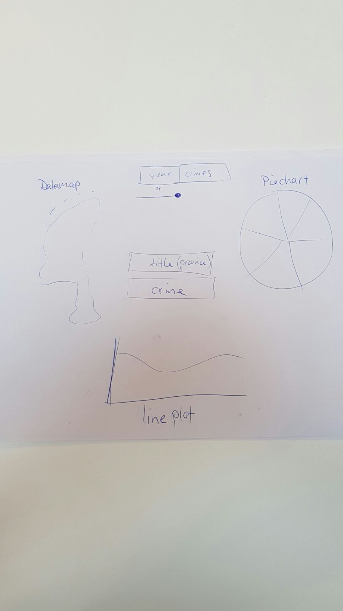

# Proposing EEG Dashboard
- Name:			Dirk Zomerdijk
- Studentnumber: 	10530274
- Education: 		Bcs. Beta-Gamma, Neurobiologie

## Paragraph Summary
- Introduction
- The Proposal Process
	* Goals	
	* Visual Sketch
	* Datasets Used
	* Decomposing The Problem
	* APIs
	* Technical Problems
- MVP

## Introduction
This webpage and its visualizations give information about crime in the Netherlands. With this page you can explore the quantity and relative occurance of certain crimes, either for the entier Netherlands or for each province individually.

The displayed visualizations will be:
- Datamap of the Netherlands
- A piechart that show relative occurance of total crime per province or when a crime is selected the relative occurance of that crime compared to total crime numbers of that province. 
- A lineplot that shows the amount of (a) crime in the Netherlands or in a province over the course of four years (2010-2014).

## The Proposal Process

### Goals
* Create a webpage in which you can explore crime in the Netherlands.
* All visualisations should be connected in some way, which should favor the user in exploring the data.
* Make the design neat, it should be easy to look at.
* 

### Visual Sketch

### Datasets Used
The datasets used are data from https://opendatanederland.org. Which contains the data about 75 crimessorts for every province in the netherlands over the course of four years (2010-2014)
And a data from http://www.metatopos.eu/provincies.html which contains the number of inhabitans for each province.
The datasets used for this project are EEG and te behavioral data that comes with it.
- The EEG data will be plotted in a linegraph. The y-axis will show the EEG value and x-axis the time of the video
- The behavioral data will be plotted as a word and the choice of the subject (yes or no). 

### Decomposing the problem
The problem can be decomposed into seven smaller problems.
<ol>
<li>The datamap visualization.</li>
<li>The piechart visualization</li> 
<li>The linechart visualization</li>
<li>A button to select a specific crime, all visualizations should show</li>
<li>A button/slider to select a specific year, all visualizations should show</li> 
<li>Interactivity between each visualization, click on visualization to control anotherone</li>
<li>Make a neat design</li>
</ol>

### APIs
D3, ofcourse, to construct the different visualizations.
Maybe Topojson, for the Datamap.
Maybe Bootstrap, for styling the page.

## MVP
The minimum viable product is considered reached if all visualizations and buttons are on the page and are linked whith eachother. Also the correct data should be shown for each visualization.

