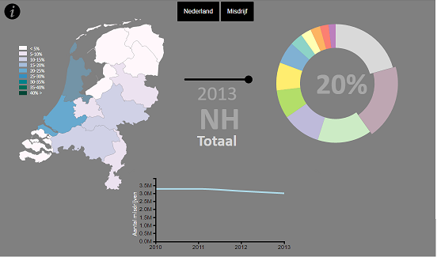

# Final Report

## Description
This webpage and its visualizations give information about crime in the Netherlands. With this page you can explore the quantity and relative occurance of certain crimes, either for the entier Netherlands or for each province individually.

## Technical Design
All visualizations on the page are interactive and use the same dataset. Each visualization is positioned statically around the titles that tell you the selected province, crime and year.
* The datamap shows the relative occurance of a selected crime in the Netherlands by filling each province with a color corresponding to the prevalence of that crime in that province.
* The piechart shows more exact the relative occurance in each province using the center of the pie which shows the percentage corrected for number of inhabitans.
* The lineplot shows the quantity of a selected crime in a selected province over the course of four years (2010-2013).
* The two buttons 'Nederland' and 'Misdrijven' can be used to set province to Netherlands (This is not a province.. but yeah) and crime to total (all crimes), or to select a specific crime respectivily.
* The slider can be dragged to select a year. The datamap and piechart will update while dragging. 
* The info button show how each visualization can be used to get data.

The datamap and piechart not only show data. They also can be used to select a crime or province or to take a quick look at the data. When the users mouse is on a province that province is highlighted, the global title changes, and the corresponding pie segment will light up with the corresponding value in percentage.
If the user clicks on the province it is selected. The province stays highlighted on the map, the global titles changes to the province untill another province is selected, the piechart shows the relative occurance of all the crimes in the dataset for that province and the lineplot updates to show the quantity of a selected crime for the selected province.
While the piechart segments are representing provinces these can be hovered and clicked to select a province in the same way the datamap does. When the segments represent crimes they can be clicked to select a crime. When a crime is selected the datamap and lineplot updates for that crime. The 'Misdrijf' button can also be used to select a crime. The piechart still shows the relative occurance of the crime.
When the user hovers there mouse over the lineplot the exact values of each year for a pecific crime and province will be displayed in a popup.

To create these interactions event handlers are used for each element on the page. For each visualization a function is written to update it whenever needed. To get the correct data for each visualization a function is written. For calculating the fill colors and for filling the datamap functions are written. 
For calculating the percentage shown in the piechart a function is written and last all eventlistners are put in a function so that after each visualization update the handlers work again.

## Process
I did not encountered major challenges with regard to my design because of the fact that most challenges were already faced during the homework assignments of a previous course. Still, while working on this project, many things fell into place considering coding. Programming the buttons and the info pop-up parts in html learned me more about positioning objects in divs and connect them with my javascript code. The discovery of all the possibilities of styling that can be achived with css was really fun.
Yet, with both these languages i had some struggles while positioning elements on the page. i've spend alot of time on trying to make the webpage scalable. In the end some parts are, but some parts are not scalable. While designing the info pop-up alot more became clear about positioning yet there was to little time for implementing this in the webpage overall.
During this project i learned more about global variables and writing functions in javascript. The use of global variables became more clear. All visualizations used the same data when updated. But when i wanted events to change previous selected objects and objects over which the mouse hovers they started to interferre. I rewrote my code and used more descriptive global variables to fix all the interferrence. After cleaning up, the events were much easier to implement.
While updating the piechart the functionality of the segements changed. On this moment i learned how easy it is to implement functions for dynamically adding attributes to objects in the wink of an eye. For the lineplot i was able to write a update function. This way the plot does not need to be removed and redrawn. In the beginning of the project each visualization had its own title. This did not look nice, and for every change all titles must be updated. 
Instead a global title is implemented and positioned in a way its clear which information the visualizations are displaying. But after this project the biggest challenge i faced and overwon is having fun in programming. In the previous courses time spend on projects was very little and my understanding of coding did not grow largely. But in this course many skills fell in place and i started to enjoy coding!
